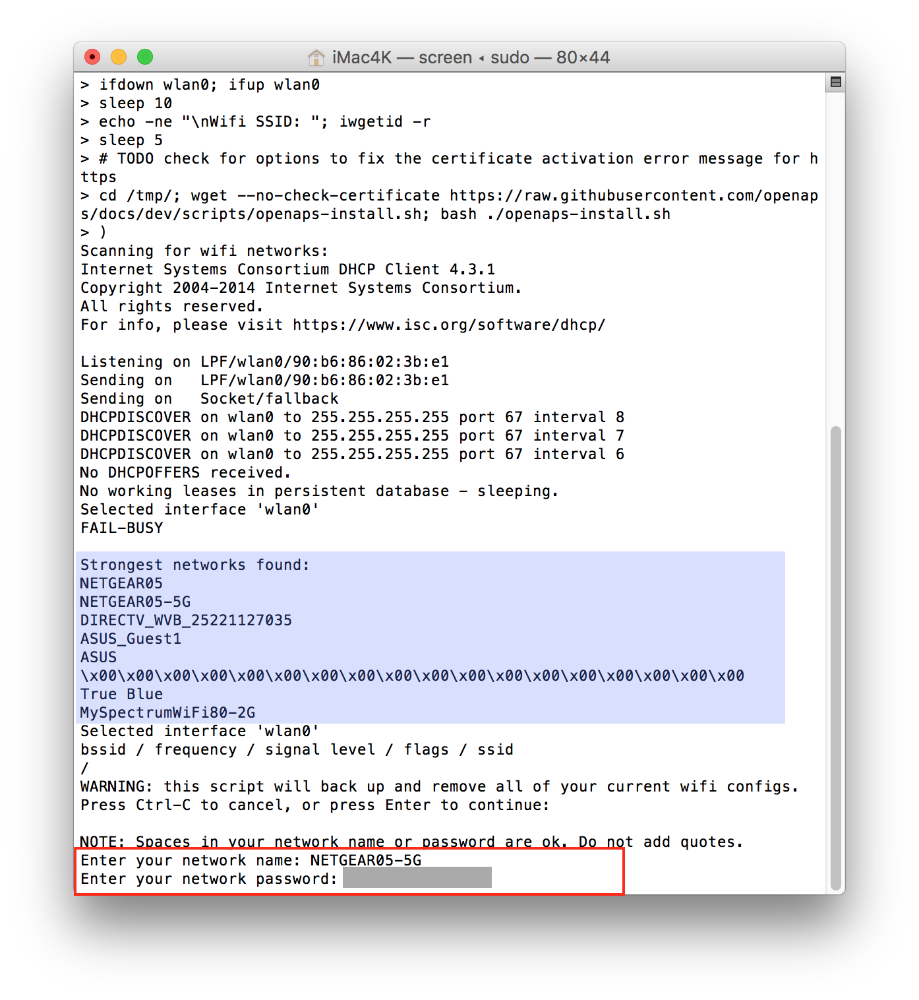
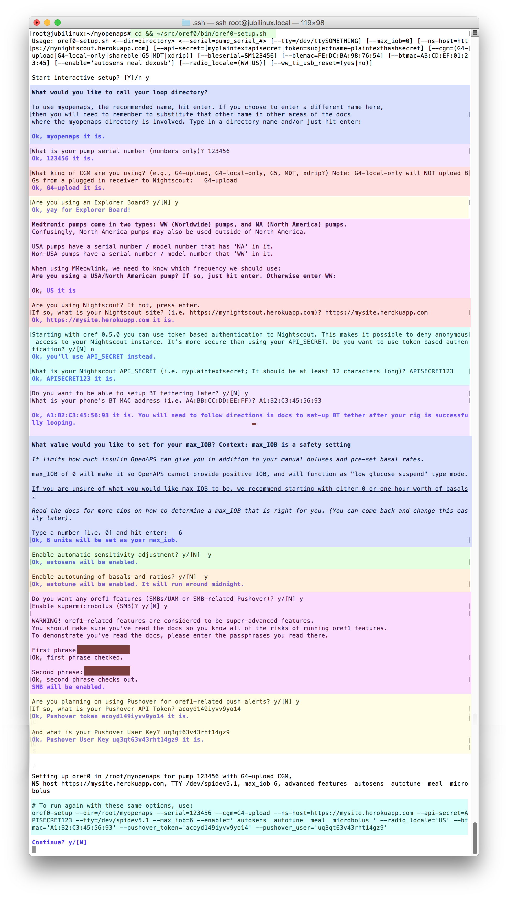
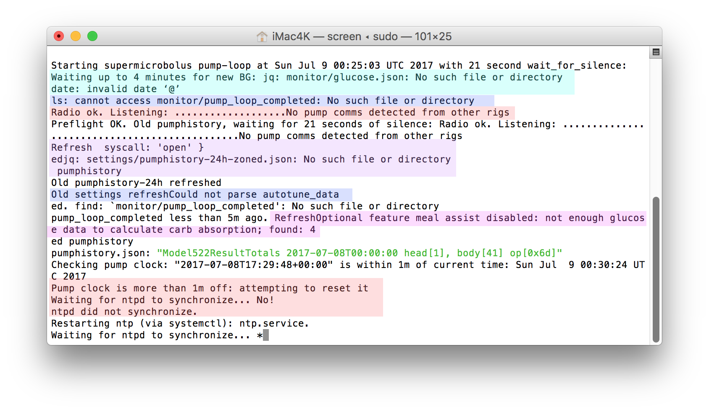
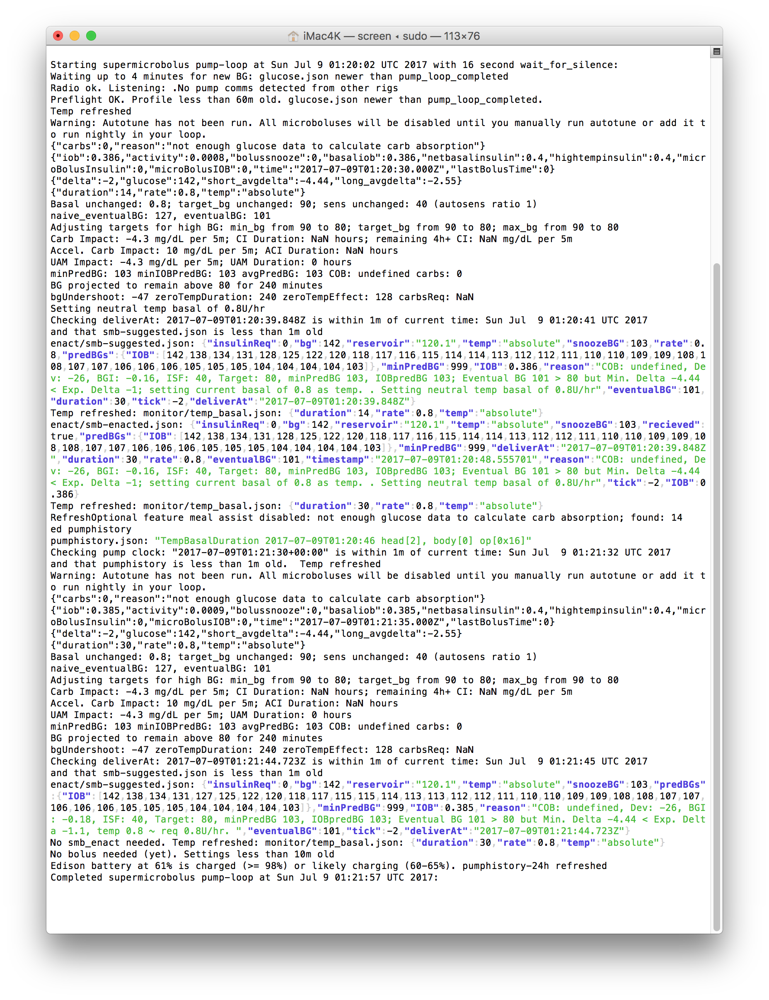

# Installing OpenAPS on your rig with an already-flashed-Edison

### Prep Steps
* **PC users:** [follow these instructions to get PUTTY and plug in your rig](windows-putty-prep.md). Then, follow the rest of the instructions below.

* **Mac users:** [follow these instructions to open Terminal and plug in your rig](mac-prep.md). Then, follow the rest of the instructions below.

### Log in to your rig

If you're not already, make sure you're logged into your rig via root. You should see root@jubilinux on the command prompt.

### Copy and paste to run the wifi and oref0-setup scripts

Go to [this webpage](https://raw.githubusercontent.com/openaps/docs/dev/scripts/openaps-bootstrap.sh) in a separate tab/window.

Copy all of those lines; go back to Terminal/PuTTY and paste into the command line. Then, hit enter.

The script will do some initial installing, check the wifi, and ask you to hit enter to proceed.

It will run for a while again, and then ask you for the following: 
* Type in your wifi and hit enter; and type your wifi password and hit enter.



* Change your hostname. **Make sure to write down your hostname; this is how you will log in in the future as `ssh root@whatyounamedit.local`**

* Pick your time zone. (i.e. in the US, you'd hit enter on US; and scroll and find your time zone, such as Eastern)

It will then continue to run a while (~10+ minutes) before initiating the oref0-setup.sh script automatically, which will ask you for the items below.

If anything fails during the installation, it may end early before it asks you these questions.  In that case, you can just paste the script into the command line again and try it again.  (Don't try to use the up arrow, it probably won't work.)

#### Be prepared to enter the following information into "oref0-setup":

NOTE: screenshot below is for the dev branch build (as of July 9).  The script will currently install master, so yours may appear differently until dev branch is merged.  Screenshot is uploaded now simply in preparation for the merge. (Also, don't expect the rainbow colored background - that's just to help you see each of the sections it will ask you about!)


**Be prepared to enter the following items:** 

* directory name for your openaps - we recommend the default `myopenaps` 
* email address for github commits
* serial number of your pump
* whether or not you are using an Explorer board
* if not an Explorer board, and not a Carelink stick, you'll need to enter the mmeowlink port for TI stick or Explorer board (built in TI stick):
    * see [here](https://github.com/oskarpearson/mmeowlink/wiki/Installing-MMeowlink) for directions on finding your port
* (if you're using a Carelink, you will NOT be using mmeowlink)
* how you are getting CGM data.  The options are `g4` (default), `g4-raw`, `g5`, `mdt`, and `xdrip`.  Note:  OpenAPS also attempts to get BG data from your Nightscout.  OpenAPS will always use the most recent BG data regardless of the source.
* Nightscout URL and API secret
* whether you want things like Autosensitivity and/or Autotune
* whether you want any oref1-related advanced features - NOT RECOMMENDED until you have run oref0 and are familiar with basic OpenAPS looping
* BT MAC address of your phone, if you want to pair for BT tethering to personal hotspot
  * Note, you'll still need to do some other steps after this section to finish enabling BT tethering
* After the setup script builds your myopenaps, it will ask if you want to schedule a cron (in other words, automate and turn on your loop) and remove any existing cron.  You'll want to answer `y` to both - and also then press `enter` to reboot after the cron is installed.

#### Log in again, and change your password

If this is your first build, after it reboots it will prompt you to log back in. Log in as "root" and the password from before (probably edison). It will ask you a second time for the current password (probably edison). However, now it will prompt you to change your password.  You'll want to change it to something personal so your device is secure. Make sure to write down/remember your password; this is what you'll use to log in to your rig moving forward. You'll type it twice.

Once you've successfully changed your password, you'll end back at the command prompt, logged in as root and ready to watch your logs while the system begins to read your pump history, gather glucose records, and begin the calculations of any needed adjustments. So it's time to watch your logs next!

## Watch your Pump-Loop Log - REQUIRED!

THIS IS A REQUIRED MUST-LEARN HOW-TO STEP - DO NOT MOVE ON WITHOUT DOING THIS! This is a key skill for monitoring your OpenAPS setup to "check" or "monitor" or "watch" the logs. 

It's easy: simply type the letter `l` (short for "log", aka the very important pump-loop.log). (*This is a shortcut for the full command, `tail -F /var/log/openaps/pump-loop.log`*.)

#### What you'll see while waiting for your first loop (common non-error messages)

If this is your first rig, you are probably (1) going to underestimate how long it takes for the first loop to successfully run and (2) while underestimating the time, you'll freak out over the messages you see in the pump-loop logs.  Let's go over what are NOT errors:



When your loop very first starts, if you are quick enough to get into the logs before the first BG is read, you will likely see: 
```
Waiting up to 4 minutes for new BG: jq: monitor/glucose.json: No such file or directory
date: invalid date '@'
```
Don't worry...once you get a BG reading in, that error will go away.

The next not-error you may see:
```
ls: cannot access monitor/pump_loop_completed: No such file or directory
```
Don't worry about that one either.  It's only going to show because there hasn't been a completely loop yet.  Once a loop completes, that file gets created and the "error" message will stop.

Next frequently confused non-error:
```
Waiting for silence: Radio ok. Listening.....No pump comms detected from other rigs
```
Well, hey that's actually a good message.  It's saying "I don't hear any interruptions from other rigs, so I won't be needing to wait my turn to talk to the pump."  That message will continue to show even when your loop is successfully running.

As the pump loop continues:
```
Refreshed jq: settings/pumphistory-25h-zoned.json: No such file or directory
```
That message will clear out once the pump history has successfully been read.

Or how about the fact that autotune hasn't run yet, but you enabled it during setup:
```
Old settings refresh Could not parse autotune_data
```
Autotune only runs at 12:05am every evening.  So, unless you're building your rig at midnight, you'll probably have to wait overnight for that error message to clear out.  Not a big deal.  You can still loop while that message is showing.  Additionally, you'll have to wait until Autotune runs before SMBs can be enacted (SMBs won't enact unless an Autotune directory exists).

And then you may have an issue about the time on your pump not matching your rig's time:
```
Pump clock is more than 1m off: attempting to reset it
Waiting for ntpd to synchronize....No!
ntpd did not synchronize.
```
This synchronization may fail a few times before it actually succeeds...be patient.  There's a script called oref0-set-device-clocks that will eventually (assuming you have internet connection) use the internet to sync the rig and pump's times automatically when they are more than 1 minute different.  (If you don't have internet connection, you may need to do that yourself on the pump manually.)

How about these daunting messages:
```
Optional feature meal assist disabled: not enough glucose data to calculate carb absorption; found: 4

and

carbsReq: NaN CI Duration: NaN hours and ACI Duration: NaN hours

and

"carbs":0, "reason": "not enough glucose data to calculate carb absorption"
```
Advanced meal assist requires at least 36 BG readings before it can begin to calculate its necessary data. So after about three hours of looping these messages will clear out.  You can watch the count-up of "found" BG readings and know when you are getting close.  

#### What you'll see when you are looping successfully ~20+ minutes later!

Finally, you should eventually see colorful indications of successful looping, with a message saying "Starting with supermicrobolus pump-loop" (or simply pump-loop if you don't have SMBs enabled) and ending with "Completed supermicrobolus pump-loop"



Reading these should give you an idea for what OpenAPS knows: current BG, changes in BG, information about netIOB (taking into account any temp basals it has set along with any boluses you have done), carbs on board, etc. Plus, it will give you information about the predictions and show you the data points it is using to draw the "purple prediction lines" in Nightscout. It also will tell you what, if anything, is limiting it's ability to give more insulin - i.e. if you have maxIOB at 0, or it is capped by one of the safety settings, etc. This information is a longer version of the information that will show in the "OpenAPS pill" on Nightscout. And - this is where it will tell you what insulin it thinks you need (more/less and how much) and what temporary basal rate (temp basal) it will try to set next to adjust and bring your eventualBG prediction into your target range.

If after 20 minutes, you still have some errors showing instead of the above successful looping information, it may be time to head over to the Troubleshooting docs to figure out where your problem is.

**Done watching the logs? Type control-C to exit the pump-loop log.**

#### Why you should learn about these logs now - and other handy shortcuts

Checking your pump-loop.log is a great place to start anytime you are having looping failures.  Your error may not be in the pump-loop, but the majority of the time, you'll get a good head start on the issue by looking at the logs first. So, develop a good habit of checking the pump-loop log to get to know what a normal log looks like so that when a real error appears, you can easily see it as out of place and needing to be addressed.  Additionally, knowing how to access your pump-loop log is important if you come to Gitter or Facebook looking for troubleshooting help...one of the first questions will usually be "what does your pump-loop log look like?"

Note: The pump-loop log is not the only log your rig generates.  There are also several other loop logs contained within your OpenAPS setup such as:

* Autosens log: `tail -F /var/log/openaps/autosens-loop.log`

* Nightscout log: `tail -F /var/log/openaps/ns-loop.log`

* Network log: `tail -F /var/log/openaps/network.log`

* Autotune log: `tail -F /var/log/openaps/autotune.log` (remember Autotune only runs at midnight, so there's not much action in that log)

These logs and other files are things you may frequently access. There are shortcuts built in to help you more easily access key files on the go. The `l` you type for logs is an example of one of these shortcuts - it's actually a shortcut for the full command `tail -F /var/log/openaps/pump-loop.log`. Here are some other shortcuts:

```
 l => tail -F /var/log/openaps/pump-loop.log
 autosens-loop => tail -n 100 -F /var/log/openaps/autosens-loop.log
 autotune => tail -n 100 -F /var/log/openaps/autotune.log
 ns-loop => tail -n 100 -F /var/log/openaps/ns-loop.log
 pump-loop => tail -n 100 -F /var/log/openaps/pump-loop.log
 cat-pref => cd ~/myopenaps && cat preferences.json
 edit-wifi => vi /etc/wpa_supplicant/wpa_supplicant.conf
 cat-wifi => cat /etc/wpa_supplicant/wpa_supplicant.conf
 edit-pref => cd ~/myopenaps && vi preferences.json
 log-wifi => tail -n 100 -F /var/log/openaps/network.log
 git-branch => cd ~/src/oref0 && git branch
 cat-autotune => cd ~/myopenaps/autotune && cat autotune_recommendations.log
 edit-runagain => cd ~/myopenaps && nano oref0-runagain.sh
 cat-runagain => cd ~/myopenaps && cat oref0-runagain.sh
```
To use these shortcuts, just type in the phrase you see on the left - i.e. `edit-wifi` and hit enter.

If you haven't already done so, please see the [Papertrail] docs (http://openaps.readthedocs.io/en/dev/docs/While%20You%20Wait%20For%20Gear/monitoring-OpenAPS.html#papertrail-remote-monitoring-of-openaps-logs-recommended) for an easy way to track all your logs.  Papertrail will even allow you to remotely track your logs when you are not logged into your rig. Setting up Papertrail and watching your logs will dramatically help you understand your rig and help troubleshoot if you run into problems.

## You're not done yet - keep reading for other customizations you may want

You're looping? Congrats! However, you're not done yet. There's still more you can do - don't forget to [check your preferences](http://openaps.readthedocs.io/en/dev/docs/While%20You%20Wait%20For%20Gear/preferences-and-safety-settings.html); [add more wifi to your rig if needed](http://openaps.readthedocs.io/en/dev/docs/Customize-Iterate/on-the-go-wifi-adding.html); [set up IFTTT for your phone or watch](http://openaps.readthedocs.io/en/dev/docs/Customize-Iterate/ifttt-integration.html); [finish Bluetooth tethering your phone](http://openaps.readthedocs.io/en/dev/docs/Customize-Iterate/bluetooth-tethering-edison.html), etc. Make sure also you've got a good understanding of which logs you can and should check, and where to find them on the go.

Remember, the performance of your DIY closed loop is up to you. Make sure you at least look at the rest of the documentation for help with troubleshooting, ideas about advanced features you can implement in the future when you're comfortable with baseline looping, and more. Plus, the docs are updated frequently, so it's worth bookmarking and checking back periodically to see what features and preference options have been added. 

(Not looping yet? No worries - remember it may take 15-20 minutes for the first loop to run; and see [the page on troubleshooting oref0-setup tips](http://openaps.readthedocs.io/en/dev/docs/Troubleshooting/oref0-setup-troubleshooting.html) you should work through before asking for help.)
