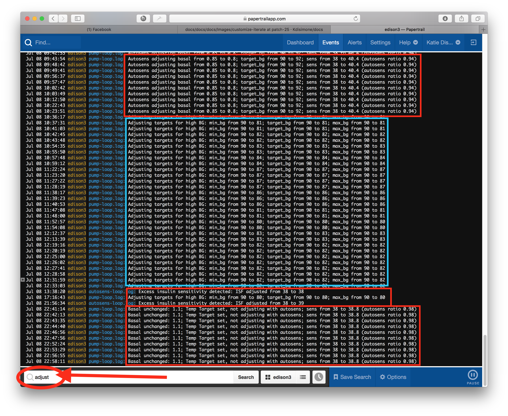

# Auto-sensitivity mode (Autosens)


Wouldn't it be great if the system knew when you were running sensitive or resistant? That's what we thought, so we created "auto-sensitivity mode". If you explicitly configure this additional feature (again by enabling it through features in setup script), it will allow the system to analyze historical data on-the-go and make adjustments if it recognizes that you are reacting more sensitively (or conversely, more resistant) to insulin than usual. Autosens will then make temporary adjustments to the basal, ISF, and targets used for calculating temp basals, in order to keep BG closer to your configured target.

When you watch your autosens log (shortcut command is `autosens-looplog`) and sensitivity changes is going to be detected, you might see something like this:
******************
-+>>>>>>>>>>>>+++->->+++>++>>+>>>>>>>>++-+>>>>>>>-+++-+--+>>>>>>>>>>>>>>>>>>>>>>>>>++-++++++--++>>>++>>++-++->++-+++++++>+>>>>>>>>>>>>>>>>>++-+-+-+--++-+--+++>>>>>>++---++----+---++-+++++>>>++------>>>++---->>+++++--+++-++++++++--+--+------++++++++++>>>>++--+->>>>>>>>>>++++-+-+---++++ 34% of non-meal deviations negative (target 45%-50%)\
Excess insulin resistance detected: ISF adjusted from 100 to 73.52941176470588
******************
Here's what each symbol above means:

 ">" : deviation from BGI was high enough that we assume carbs were being absorbed, and disregard it for autosens purposes

 "+" : deviation was above what was expected

 "-" : deviation was below what was expected

 "=" : BGI is doing what we expect

### Autosens adjustments

If you have papertrail setup (or are watching similarly through your rig itself), you can get an idea of how often, how much, and what autosens is adjusting.  For example, here's a screen capture using "adjust" as the search filter for one of my rigs.



As you can see, there are several types of adjustments that have occured during the day.  
* In the morning, autosens was detecting some excess insulin sensitivity...so basals, targets, and ISF were adjusted down (by multiplier of 0.94).  
* Later in the day (the blue boxed section), another adjustment was made to her BG targets because of a persistent high.  While not an adjustment by autosens itself, this is similar and can be set in preferences.json by setting the "adv_target_adjustments" to true.  Basically this preference will automatically lower BG targets (to as low as "eating soon" mode target of 80 mg/dl) for persistent high BGs.  
* Later in the day, a couple brief periods of insulin sensitivity were short-lived.
* Finally at night, we had a low-treatment for a BG.  We use an IFTTT button to enter our low treatments and at the same time, the IFTTT sets up a temp target of 110 mg/dl for 60 minutes to make sure the loop doesn't want to correct much on the recovery.  That temp target is being respected by autosens and basals and targets are not being adjusted (even though autosens may like to).  

### Notes about autosensitivity:

* "Autosens" works by reviewing the last 24 hours of data (so it's a rolling calculation with a moving window of 24 hours) and assessing deviations to determine if you are more sensitive or resistant than expected. If a pattern of such deviations is detected, it will calculate the adjustment that would've been required to bring deviations back to normal.
* Autosens does NOT take into account meal/carb deviations; it only is able to assess the impact of insulin, and thus will adjust ISF, basals, and targets to help compensate for changes in sensitivity.
* Most users will notice the changed ISF numbers in their OpenAPS pill, along with changed targets. Note that a temp target will override the autosens-adjusted target. If you do not want autosens to adjust targets, that can be turned off by editing preferences.json (shortcut command `edit-pref`) and setting the "autosens_adjust_targets" to false.
* The reason for autosens automatically adjusting targets is because the other adjustments it makes can't be fully applied without creating a feedback loop, so automatically adjusting the target it thinks it's shooting for lets autosens get BG closer to your actual target most of the time. When autosens needs to adjust basal and ISF, it can very straightforwardly use that for adjusting the temp basal it's about to set, by assuming a higher or low neutral temp basal to start from, and by calculating a bigger or smaller expected impact of current IOB.  What it can't do is calculate IOB in a way that reflects the adjusted basals and ISF, because doing so would change the autosens result, which would require recalculating IOB again, which would further change the result, in an unpredictable feedback loop. So instead, we simply acknowledge that the IOB calculation doesn't reflect sensitivity or resistance, and instead adjust the target to compensate. 
* Autosens is limited by the safety multipliers in preferences.json. The defaults are:
```
"autosens_max": 1.2, <----multiplier for adjustments during insulin resistance
"autosens_min": 0.7, <----multiplier for adjustments during insulin sensitivity
```
We do not recommend widening these multipliers; but an easy way to turn "off" autosens after you've enabled it is to adjust the safety multipliers to 1. However, note that this will also disable autotune adjustments if you are running autotune. 

### Autosens vs Autotune

Autosens will make adjustments to whatever basal, ISF, and target profiles are currently set for the loop.  If autotune is not enabled, that means autosens will be making on-the-go adjustments based on the settings read from your pump.  If autotune is enabled, that means autosens will be using the autotuned-profile as the basis for making adjustments.

Since SMBs require a minimum basal rate of 0.3 U/hr, it is possible that your auto-adjusted basal rate used by the loop may end up being lower than what is programmed in your pump.  If you expect to see SMBs enacting, but your pump basal rate is very close to 0.3 U/hr...adjustments by autosens and/or autotune may change your basal rate to be less than 0.3 U/hr.
