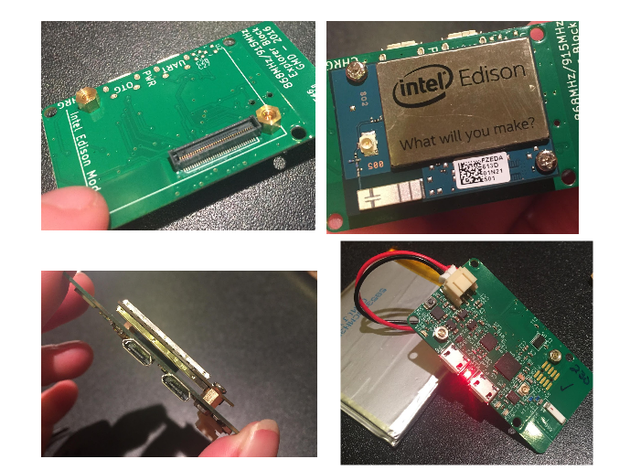

# Understanding your Edison/Explorer Board rig

## Getting Physical: Build your rig/put the physical pieces together

The Explorer board is where all the communications are housed for the rig, as well as the battery charger.  The Edison is the mini-computer where all the OpenAPS code will be sent and used.  In order for this to work, first you have to screw and connect the Edison and Explorer Board together with the nuts and bolts you order.  

The nuts and bolts are tiny, and the spaces are a little tight.  I find it really helps to use a set of tweezers and a small Phillips head screwdriver.

It's easiest to start with the Explorer board and put on 2 nuts and gold screws (nuts on the side with most of the wiring) inside the little outline where the Edison will eventually sit.  Gold screws should be placed as shown, with nuts on the backside.  Then, lay the Edison board on top, aligning the screw holes.  Use a small Phillips head screwdriver to tighten the screws into the gold screws beneath them.  The Edison board should not wobble, and should feel secure when you are done.  Attach your battery into the explorer board plug.  A single red light should appear and stay lit.  During the course of your OpenAPS rig use, it's good practice to periodically check that the nuts and screws stay tightened.  If they come loose, the Edison can wobble off the connection to the Explorer board and you will either get looping failures (if it's loose) or be unable to connect to the Edison (if it comes completely off).

 

### Charging

You can charge your rig via either port

### What the lights mean and where they are

* The LED between the two ports is the power. If this light is on, your rig is on.
* The LED in the corner is the charging indictator.
* The two next to the microUSBs (one green on the latest boards) are for the cc1110 radio chip. By default they just blink once each when you mmtune or otherwise reset it.

### Where is the power button?

The little black button on the end of the board near the JST connector is the power button. To 

### Where is the radio stick?

The radio and antenna are down on the end of the board where you see a little white stick. (Opposite end of the board from where your battery connects at the JST connector). 
