# Papertrail remote monitoring of OpenAPS logs (RECOMMENDED) 

If you want to remotely view the rig's logs/loops, you can use Papertrail service.  We HIGHLY recommend setting up this service for at least the first month of your OpenAPS use to help remotely and quickly troubleshoot your rig, if you have problems.  The first month of Papertrail comes with a very generous amount of free data.  If you decide you like the service, you can sign up for monthly plan.  Typically, the monthly cost for using Papertrail with OpenAPS is approximately $5-7 depending on how many rigs you use and how long you'd want to save old data.

### Get an account at Papertrail

Go to http://papertrailapp.com and setup a new account.  Choose to setup a new system.  Notice the header at the top of the new system setup that says the path and port that your logs will go to.  You’ll need that information later.

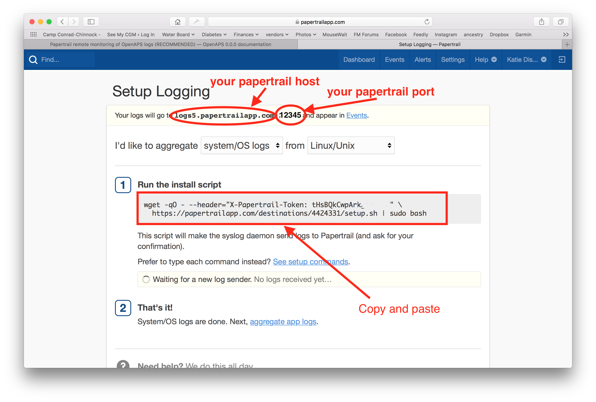

### System logging 

Login to your rig. If you need help with that, please see the [Accessing Your Rig](http://openaps.readthedocs.io/en/latest/docs/walkthrough/phase-2/accessing-your-rig.html) section of these docs.  Copy and paste the code that is displayed in your new system setup's shaded box, as shown in the red arrowed area in the screen shot above. This will setup papertrail for just your syslogs.  But, we now will need to add more (aggregate) your logs such as pump-loop and ns-loop.

### Aggregating logs

* Copy and paste each of these four command lines, one at a time.  The screenshot below shows the successful results of each command.  The first command will run for a short time and end with similar information to the green box.  The remaining three commands will not display anything specific as a result of the command.

`wget https://github.com/papertrail/remote_syslog2/releases/download/v0.19/remote_syslog_linux_i386.tar.gz`

`tar xzf ./remote_syslog*.tar.gz`

`cd remote_syslog`

`sudo cp ./remote_syslog /usr/local/bin`

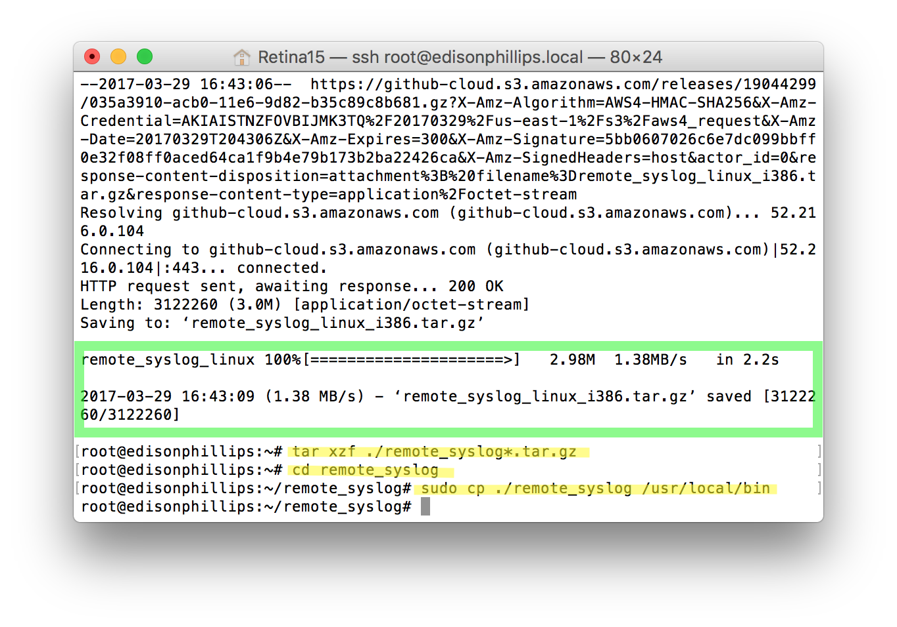

* Create the file that will store all the logs you'd like to aggregate:

`vi /etc/log_files.yml`

* press "i" to enter INSERT mode, and then copy and paste the following (updating your host and port on the lines shown to match what your new system info shows as described above):

```
files:
 -  /var/log/openaps/pump-loop.log
 -  /var/log/openaps/autosens-loop.log
 -  /var/log/openaps/ns-loop.log
 -  /var/log/openaps/network.log
 -  /var/log/openaps/autotune.log
 -  /var/log/openaps/cgm-loop.log
 -  /var/log/openaps/pushover.log
destination:
  host: logs5.papertrailapp.com # NOTE: change this to YOUR papertrail host!
  port: 12345   # NOTE: change to your Papertrail port
  protocol: tls
```
type ESC and ":wq" to save changes and exit.

* Start a new aggregate

`sudo remote_syslog`

Now you should be able to see your new logs in your papertrail, but we need to make it so this runs automatically when the rig is restarted.

### Install auto restart at reboot

* Create a new file that will restart the papertrail logging at reboot

`vi /etc/systemd/system/remote_syslog.service`

* press "i" to enter INSERT mode, and then copy and paste the following:

```
[Unit]
Description=remote_syslog2
Documentation=https://github.com/papertrail/remote_syslog2
After=network-online.target

[Service]
ExecStartPre=/usr/bin/test -e /etc/log_files.yml
ExecStart=/usr/local/bin/remote_syslog -D
Restart=always
User=root
Group=root

[Install]
WantedBy=multi-user.target
```

type ESC and ":wq" to save changes and exit.

* enable the reboot service by using these two commands, one at a time.

`systemctl enable remote_syslog.service`

`systemctl start remote_syslog.service`

* reboot your rig to test the papertrail

`reboot`

and then go to your papertrailapp website to see the log

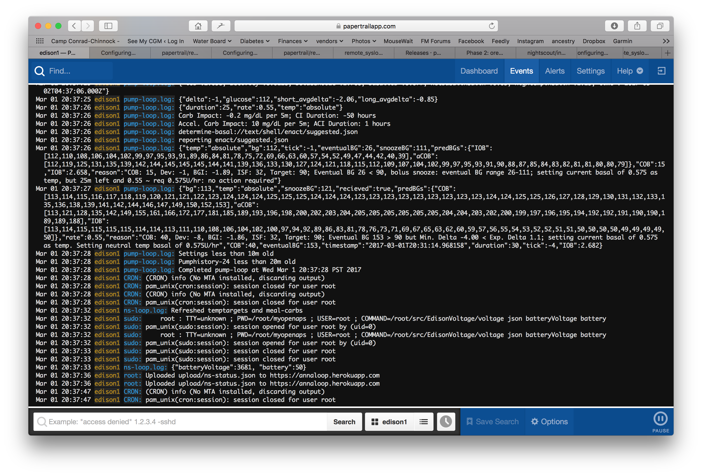

### Optimize Papertrail use

To make the most of your Papertrail logs, setting up some of your account settings and filters will help streamline your troubleshooting

#### Account Filters

Adding filters to your incoming Papertrail logs will help minimize unuseful data (and help keep you below your data caps) and streamline your review of your relevant OpenAPS logs.  You can go to your Papertrail account's `Settings` and then choose the `Log Destinations`. Click on `Log Filters` to go to the screen where you can add specific filters.

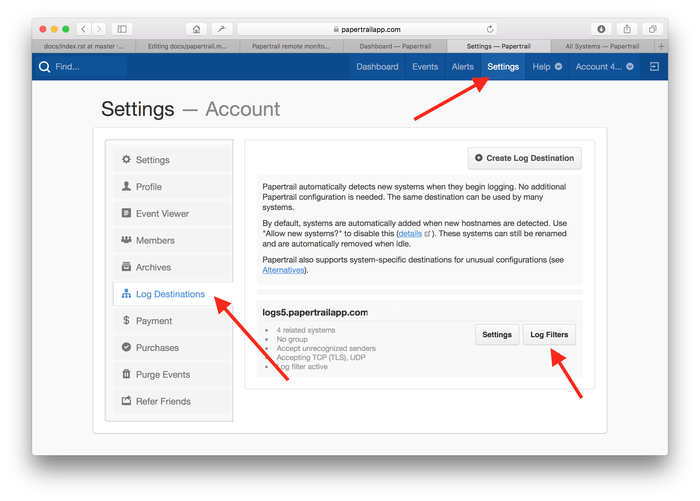

Click on the `Add Log Filter` button and add three filters for `CRON`, `libmraa`, and `sudo`.  Save the changes and within 60 seconds, your logs will be filtered.  The CRON, libmraa, and sudo logs usually provide very little help for troubleshooting OpenAPS problems.  You can always undo these filters, if you want to see what those provide in the future.

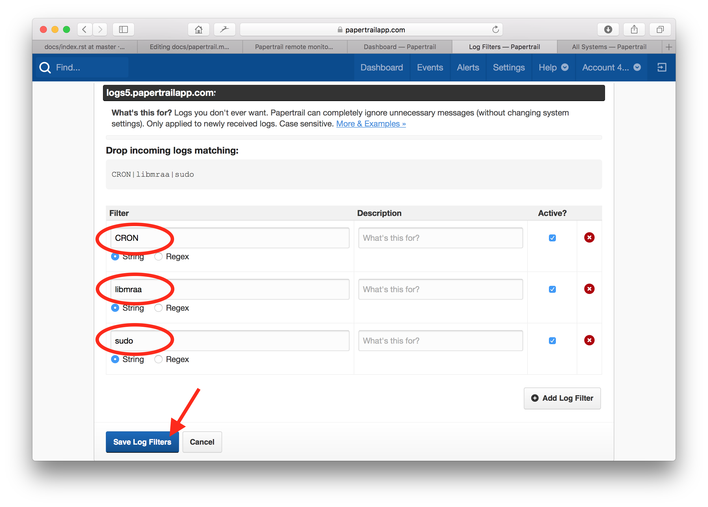

#### Saved Filters

Unfortunately, Papertrail does not currently have an app for use on mobile devices.  Instead, you will be using an internet browser to view your papertrail.  Setting up saved filters, in advance, can help you sort through your logs more efficiently.  Most OpenAPS troubleshooting will involve either wifi connection issues or pump communications.  Some helpful filters to save to find those issues fastest are:

* `pump-loop.log` to see just your pump loop...similar to using the `l` command when logged into your rig.  

* `network` will show just your oref0-online results and whether/which wifi network your rig is connected to.  If you see results of `192.168.1.XX`, then your rig is likely connected to a wifi network.  If you see results of `172.20.10.XX` then your rig is likely connected to your phone's personal hotspot.  If you see `error, cycling network` results, you should check out troublehsooting steps.

* `pump-loop.log adjust` will show your basal and ISF adjustments being made by autosens, if enabled.

If you are running multiple rigs, you can also setup these filters to include the hostname of a particular rig, if you want to filter just for that rig.  For example, this screenshot below would be setting and saving up a filter for a particular rig with the hostname of `edison1` and only for its pump-loop.log.  

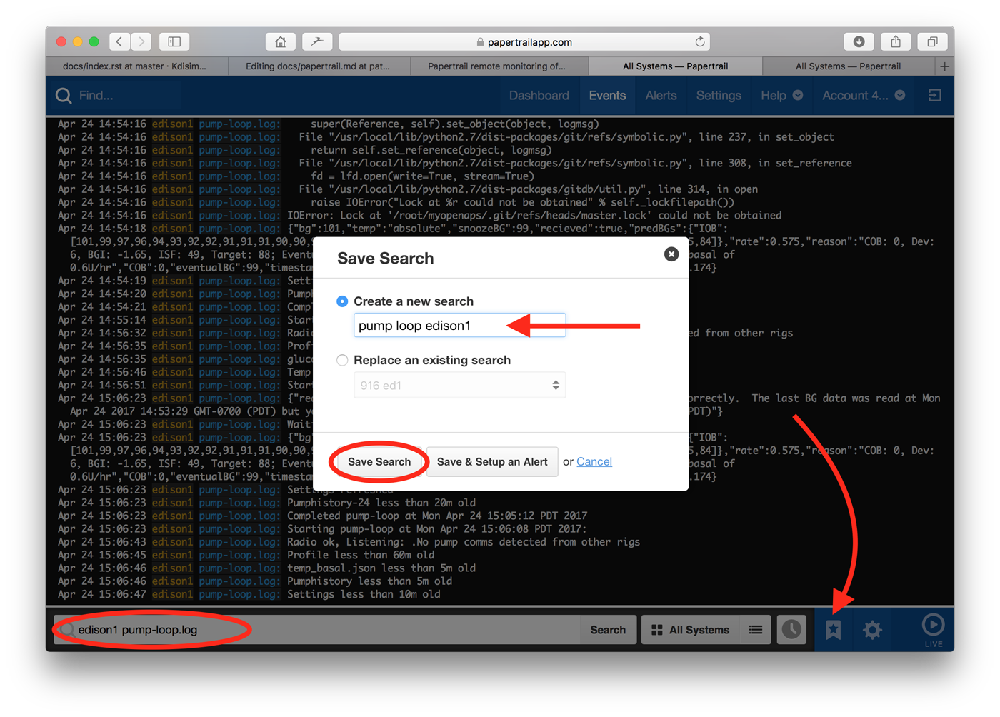

Once you get your desired filters saved, it is an easy process to make them more accessible on your mobile device by using the `add to homescreen` button.  For example, below are the quick links to the saved filters for an OpenAPS user with three rigs...

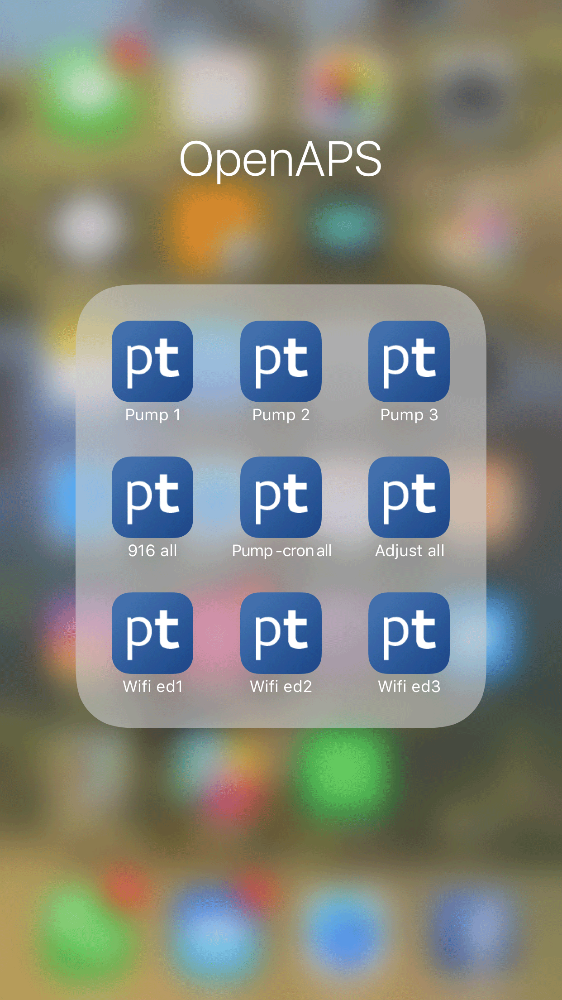

#### Troubleshooting using Papertrail

Papertrail can be very valuable to quickly troubleshoot a rig, becuase it is quite easy to see all the loops that log information about your rig's actions.  BUT, the way that the information comes into Papertrail is based on the time the action took place.  So, you'll be seeing information stream by that may or may not help you troubleshoot WHICH area your issues are.

First, let's start with messages that **ARE NOT ERRORS**

* Anything in the first 15 minutes (pretty much) of a new loop setup.  Let the loop run for 15 minutes before you start to investigate the messages.  Many messages resolve themselves during that time, such as `cat: enact/enacted.json: No such file or directory` is because the loop hasn't enacted a temp basal suggestion yet...so the file doesn't exist.

* `Radio ok. Listening: .No pump comms detected from other rigs` This message is NOT an error.  This means your rig is checking to make sure it is not interrupting another rig that may already be talking to your pump.  It's being polite.

* `[system] Failed to activate service 'org.freedesktop.hostname1': timed out` This message is NOT an error. Jubilinux does not use the hostname service...so it does not activate.

* Many messages that say there are failures, are not really failures for your rig.  For example, there are a lot of scary looking messages when your rig is changing networks from wifi to/from BT...an unfiltered papertrail will show every message like this:

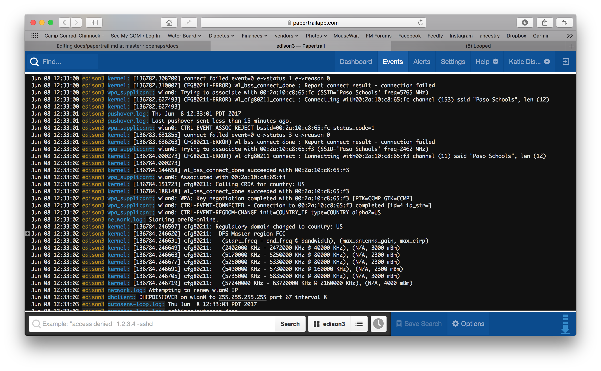

But, really, most of those messages are the normal course of the rig telling you what's going on.  Like "Hey, I seem to have disconnected from the wifi...I'm going to look for BT now.  Hold on.  I need to organize myself.  Bringing up my stuff I need to find BT.  Ok, found a BT device.  Well, I can connect to it, but some of the features I don't need...like an audio BT connection."  But, the rig doesn't speak English...it speaks code.  So, if you don't speak code...sometimes a filer for `network` might help you filter for the English bits of info a little better.  Here's what that same period of time looked like with a `network` filter applied.  It's a little more clear that my rig was changing from a BT tether to a wifi connection when you filter the results.

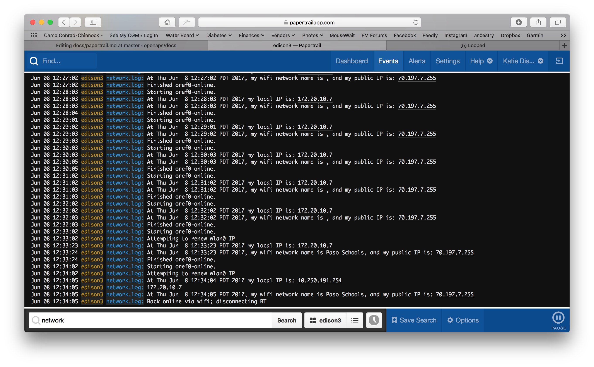

Therefore when you start to troubleshoot, **USE YOUR FILTERS** to narrow down the logs that you are looking at.  Here are some specific errors/issues you may find.

**PUMP TUNING**

Use `pump-loop` search filter to start with.  What messages are you seeing?  Poor pump comms are one of the most frequent causes of loops stopping.  If you see `916, 0, -99` tuning results, then you know that your rig is not getting a useable communication with your pump.  Try moving your pump and rig closer together.  Check if your pump battery is good.  

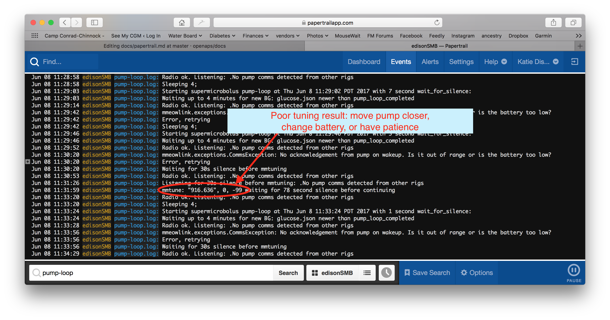
 
 Ideally you should be seeing pump tuning somewhat like the filter for `mmtune` below shows...this is a kid at school, carrying the rig in a purse/backpack.  Some periods of time she leaves her rig behind (like PE class) and other shorter times where there's poor pump comms.  But, generally speaking seeing mmtune results in the 70s and 80s will sustain good looping.
 
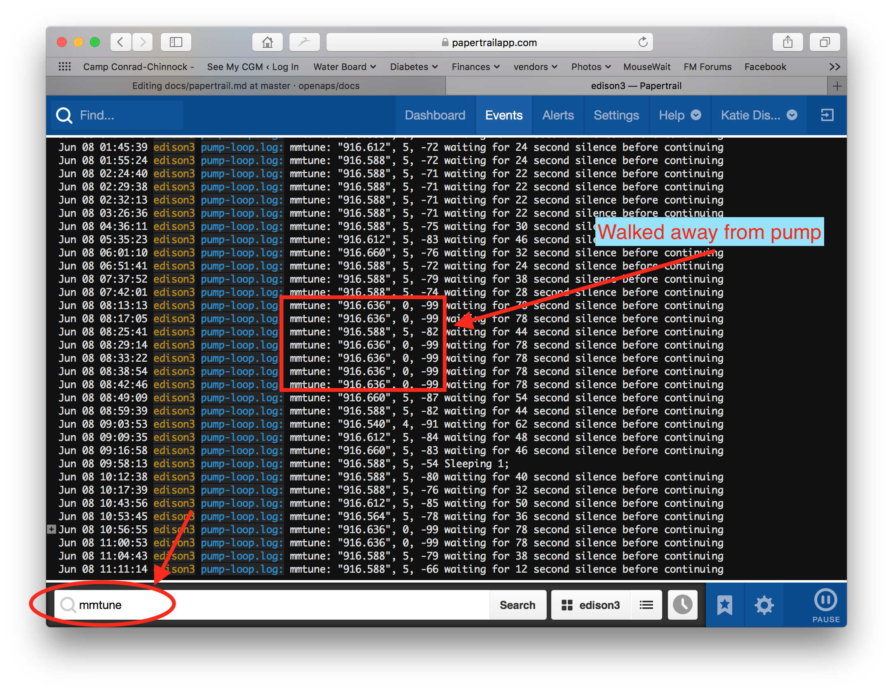

**GIT LOCK**

There are files that get written to in a directory called `/root/myopenaps/.git`  Sometimes a process crashes and causes a file in that directory to get locked and the writing can't continue.  Your loop may fail as a result.  This can be a short term issue, and it could resolve on it's own...other times it may require you to delete the file that is causing the problem.  For example, below is a short-term error.  The message says there is a problem in the `/root/myopenaps/.git` and I may need to remove that file to get things going again.  However, you can also see that a few minutes later, the problem resolved on its own.

If you find a .git lock error is causing a long period of time where your loop is failing, you can remove the file, as the error suggests by using `rm -rf /root/myopenaps/.git/filename`  or you can delete the whole `.git` directory (it will get rebuilt by the loop automatically) with `rm -rf /root/myopenaps/.git`

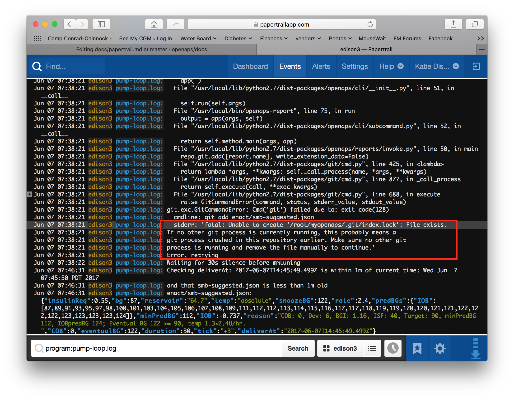

**FLAKEY WIFI**

Having flaky router or wifi issues?  Some routers or ISPs (I still haven't completely determined the cause) will not work nice with the Avahi-daemon.  What the means for you...spotty time staying connected to your wifi.  Does your rig not loop consistently?  Sometimes are you getting kicked out of ssh sessions with your rig?  Look for this message `kernel:  [101078.937641] wl_host_event: mismatched OUI, bailing` or the message shown in the screenshot below:

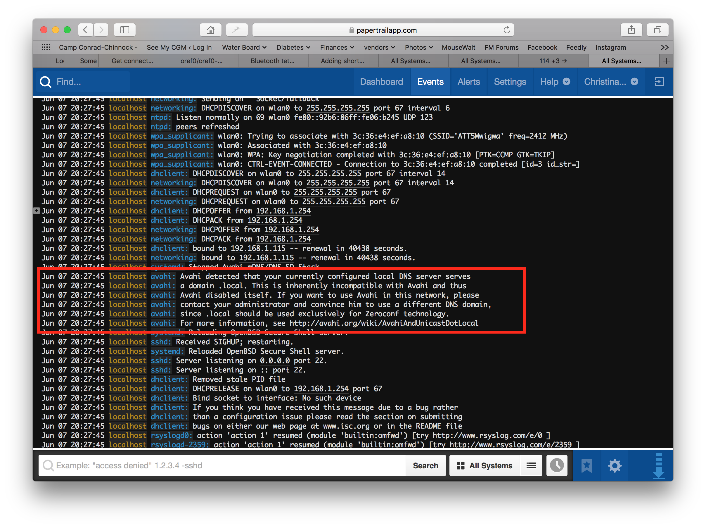

Or alternatively, if you see this message when you login to your rig:

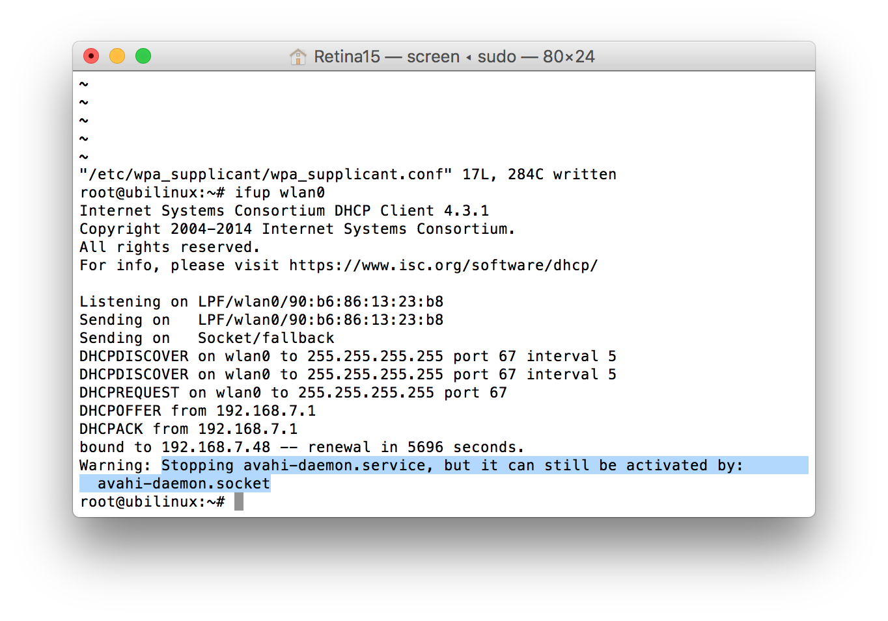

The solution to this is to login to your rig and use this command `systemctl disable avahi-daemon` as shown below

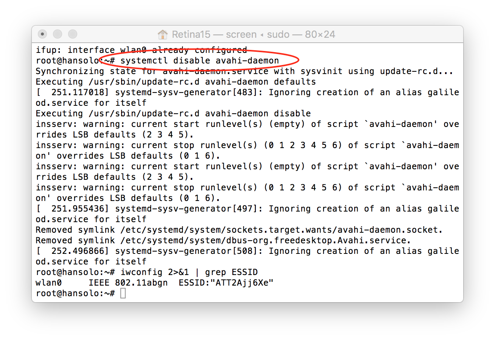

AND also edit your hosts file to remove "localhost" from the list.  Use `nano /etc/hosts` and delete the `localhost` from the 127.0.0.1 line so that it only lists the hostname of your rig...as shown below.  (NOTE:  Your edison hostname will be different than shown on the image below.)  Also by removing localhost, your papertrail systems will all be under one name, not split between localhost and your edison hostname.

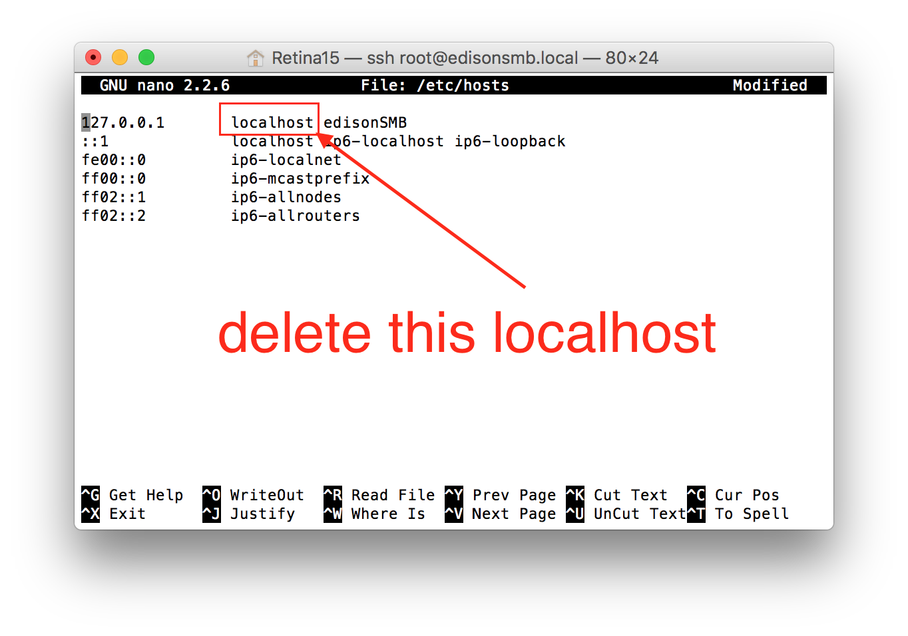

**subg_rfspy state or version??**

If your loop is failing, lights are staying on, and you see repeated error messages about "Do you have the right subg_rfsby state or version?" as below, then you need to head to [this section of docs](http://openaps.readthedocs.io/en/latest/docs/Resources/troubleshooting.html#could-not-get-subg-rfspy-state-or-version-have-you-got-the-right-port-device-and-radio-type) to fix that issue.  Don't worry, it is a 5 minute fix.  Very straight-forward.

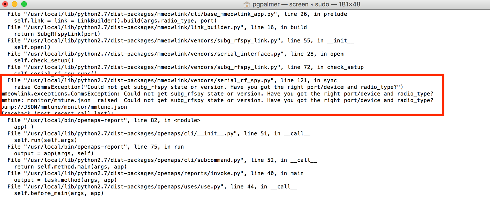

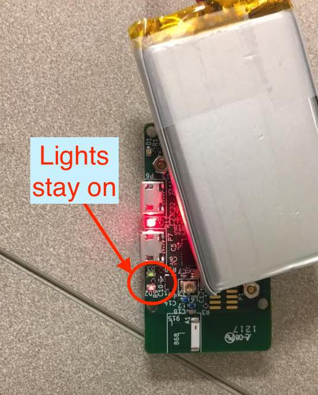
