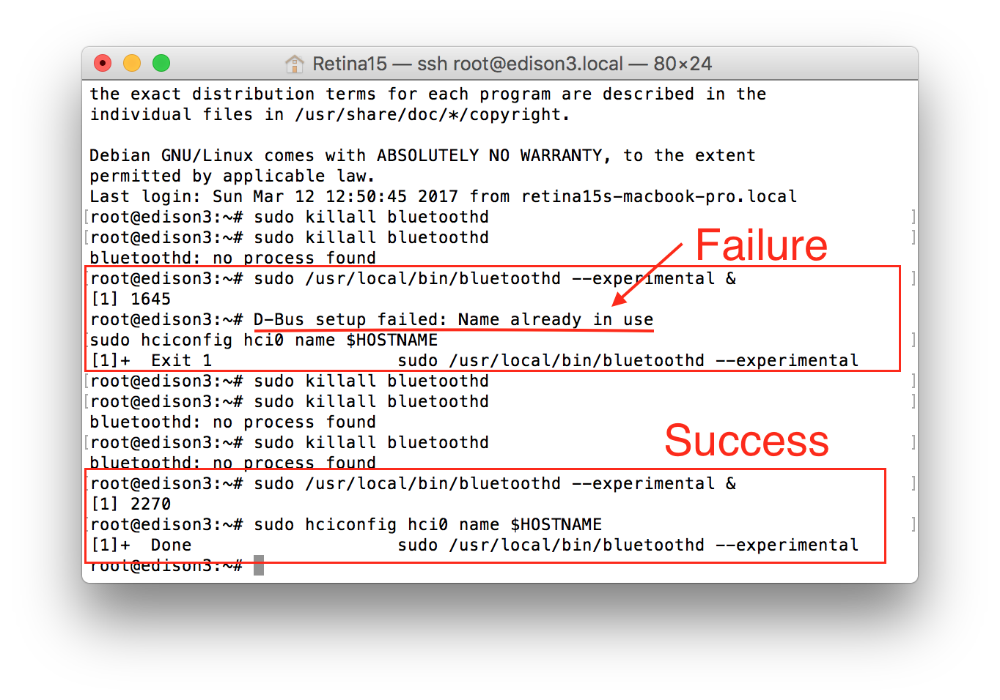
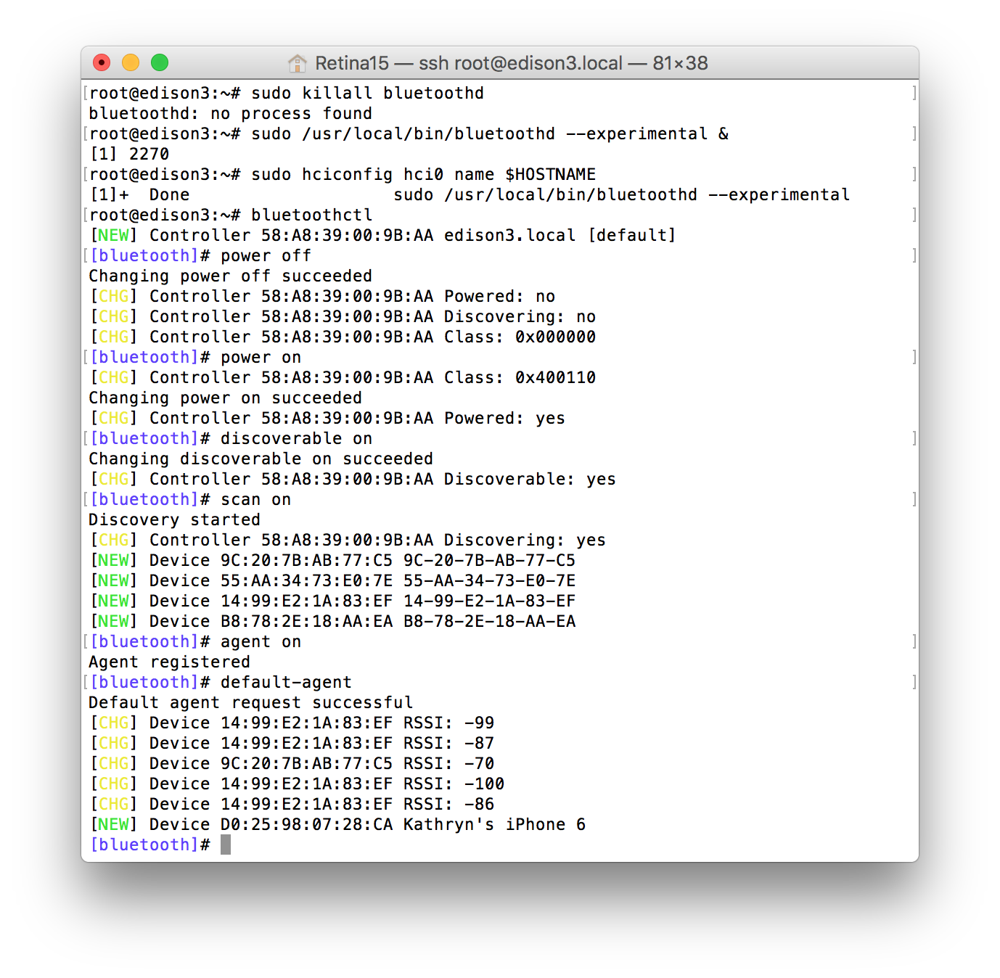

# Bluetooth tethering on Edison (optional) 

Your cell phone can act as a mobile "hotspot" to allow your rig to access the internet.  This is an important part of keeping your rig looping, if you don't have offline BG data setup, as you move around areas without known wifi networks.

A few things to know about using your phone's hotspot feature:

1. Hotspot is a feature of your phone AND cell phone provider.  Please check with your cell phone provider and your service contract to confirm that hotspot feature is enabled and BT tethering is enabled.
2. Hotspot, when activated, uses your cell phone's data.  Know what your cell phone plan data limits are and consider if you want to change/update based on your frequency of hotspot use.  You can get an estimate of cell data use by resetting your cell data use, at the beginning of the day, within your phone.
3. A device (like your rig) can be connected to your phone's hotspot in one of 3 ways; wifi connection, BT tether, or USB plug.

** wifi connection:  You need to set up your wpa_supplicant list to include your hotspot information; network name and password.  The wifi signal for the hotspot is not constantly broadcast by your phone, however.  So when you want to use the wifi connection to your hotspot (for example, you are leaving your home wifi network and traveling), you will need to manually toggle your hotspot on so that the phone will broadcast a wifi signal for the rig to connect to.  The other consideration is that since this is a wifi connection, the rig will not automatically disconnect when you come into one of your other known wifi networks.  You will have to remember to manually disconnect (toggle hotspot off), if you do not wish to continue using cell data when you are home.  Hotspot done by wifi connections also use more phone battery than a BT tether connection.

** BT tether:  BT tethering requires your phone and rig to be BT-paired before they can connect (that's what this section of the docs is specifcally about).  The advantage of connecting to your hotspot via BT tether is that it will happen automatically.  You do not have to remember to toggle hotspot.  Simply leave your hotspot toggled on as usual, leave the house, and within a few minutes (or sooner) your rig will BT tether to the hotspot.  Your rig will then use your cell phone as its internet connection.  

** USB plug: You can plug devices into your cell phone to use hotspot.  However, the phone would pull battery power from your rig and would drain your battery fairly quickly.  This is not a recommended connection method for openaps use.

## Configure Bluetooth tethering on Edison running Jubilinux [optional]

### Install dependencies 

You will need to get the MAC address from your phone or whatever device you are using.
* On Android, go to Settings/About Phone/ Status; you will a Bluetooth adress looking like AA:BB:CC:DD:EE:FF 
* On iPhone, go to Settings/General/About and it will be under Bluetooth and will look like AA:BB:CC:DD:EE:FF

Now we need to re-run oref0-setup with the Bluetooth option, replacing AA:BB:CC:DD:EE:FF with what you found above.  If you have the "To run again with these same options" command-line from the last time you ran oref0-setup, you can simply run that and append `--btmac=AA:BB:CC:DD:EE:FF` to the end.  If not, you can run it interactively using:

`cd && ~/src/oref0/bin/oref0-setup.sh --btmac=AA:BB:CC:DD:EE:FF`

NOTE:  Make sure the MAC address is in ALL CAPS.

Copy and paste the "To run again with these same options" command into your notes for the next time you need to run oref0-setup.

The first time running the script will take quite a bit longer as it is installing Bluez on your edison.
The oref0-setup script may fail after installing the Bluez.  If so, just reboot your edison and run the command you copied to your notes. 

You can confirm that Bluez has properly installed by using `bluetoothd --version`.  If Bluez installed properly, `5.37` should be returned.  If it did not install properly, you will likely see `5.28`.  The procedures below will not work with the outdated version, so make sure you get `5.37` installed before continuing.

```
root@edisonhost:~# bluetoothd --version
5.37
```

### Bluetooth setup

* Restart the Bluetooth daemon to start up the bluetooth services.  (This is normally done automatically by oref0-online once everything is set up, but we want to do things manually this first time):

`sudo killall bluetoothd`

* Wait a few seconds, and run it again, until you get `bluetoothd: no process found` returned.  Then start it back up again:

`sudo /usr/local/bin/bluetoothd --experimental &`

As shown in the "success" section below, you should see a single line returned with a short string of numbers and then be returned to a clean prompt.  If you instead see messages about D-bus Setup failed (as shown in the "Failure" part of screenshot), or otherwise see that you don't have a clean prompt returned in order to enter the next command...go back to the `sudo killall bluetoothd` and try again. 



* Wait at least 10 seconds, and then run:

`sudo hciconfig hci0 name $HOSTNAME`

* If you get a `Can't change local name on hci0: Network is down (100)` error, start over with `sudo killall bluetoothd` and wait longer between steps.

* Now launch the Bluetooth control program: `bluetoothctl`

* and each of the following:

```
power off

power on

discoverable on

scan on

agent on

default-agent
```


For Android
********************************
The adapter is now discoverable for three minutes. Search for bluetooth devices on your phone and initiate pairing. The process varies depending on the phone and the dongle in use. The phone may provide a random PIN and bluetoothctl may ask you to confirm it. Enter 'yes'. Then click 'pair' on the phone. 

For iPhone
********************************
<b>Your iPhone must be on the Settings/Bluetooth screen</b>, and then you use the Edison to initiate pairing:
```
pair AA:BB:CC:DD:EE:FF
```
********************************
If successful, you will see on the Edison:

`Request confirmation
[agent] Confirm passkey 123456 (yes/no): yes`

* (WARNING: You must type in **yes** not just **y** to pair)

* On your phone, tap the pair button that popped up.

Troubleshooting note: If after the `pair AA:BB:CC:DD:EE:FF` command you get a response of `Failed to pair: org.bluez.Error.AlreadyExists`, that means you likely have already tried to pair previously...but have run into problems getting it to run properly.  Double-check that your cell provider allows for personal hotspots and bluetooth tethering.  Make sure you have enabled those for your device.  If you have confirmed those, you can `remove AA:BB:CC:DD:EE:FF` and start at the sudo commands again to attempt a fresh pairing.

* Execute the `paired-devices` command to list the paired devices -

Your paired phone should be listed (in this example, a Samsung Galaxy S7):
```
paired-devices
Device AA:BB:CC:DD:EE:FF Samsung S7
```

* Now trust the mobile device 

`trust AA:BB:CC:DD:EE:FF`

* Quit bluetoothctl by typing 'quit' and hitting enter.


******************************

### Testing to make sure it works after you successfully did the above

* Before testing your connection, first restart the Bluetooth daemon again:

`sudo killall bluetoothd`

* Wait a few seconds, and run it again, until you get `bluetoothd: no process found` returned.  Then start it back up again:

`sudo /usr/local/bin/bluetoothd --experimental &`

* Wait at least 10 seconds, and then run: `sudo hciconfig hci0 name $HOSTNAME`

* If you get a `Can't change local name on hci0: Network is down (100)` error, start over with `killall` and wait longer between steps.

* Make sure your phone's hotspot is enabled (but don't let anything connect via wifi).

* Now, try to establish a Bluetooth Network connection with your phone:

`sudo bt-pan client AA:BB:CC:DD:EE:FF`

* You should see an indicator on your phone (a blue bar on iPhone) that your Bluetooth network connection has established.  

* Next, to test your Internet connectivity, you'll need to get an IP address:

`sudo dhclient bnep0`

* If that succeeds, you should be able to run `ifconfig bnep0` and see something like:

```
bnep0     Link encap:Ethernet  HWaddr 98:4f:ee:03:a6:91
          inet addr:172.20.10.4  Bcast:172.20.10.15  Mask:255.255.255.240
```
(for iPhone, the inet addr will always start with 172.20.10. - Android will likely be different)

* To disconnect the connection, you can run:

`sudo bt-pan client -d AA:BB:CC:DD:EE:FF`

* Next, to test that Bluetooth starts up automatically, you can shut down your wifi for 2-3 minutes by running:

`iwconfig wlan0 txpower off; sleep 120; iwconfig wlan0 txpower auto`

* About 1 min later, your rig should connect to your phone with Bluetooth (blue bar will pop up on the iPhone).  If it doesn't, you should be able to wait 3 minutes and your terminal session should automatically reconnect.  If that doesn't connect, you'll either need to reboot it or use a serial console connection to your Edison to troubleshoot further.

* About a minute after wifi comes back on (terminal session restores), your Edison should automatically disconnect the Bluetooth connection.

Finally, it's time to take a walk.  About a minute after walking out of range of your home wifi, you should see that a device is connected to your phone via Bluetooth. Shortly after that you should see things update on Nightscout.  About a minute afer you come home, it should reconnect to wifi and automatically disconnect Bluetooth.
