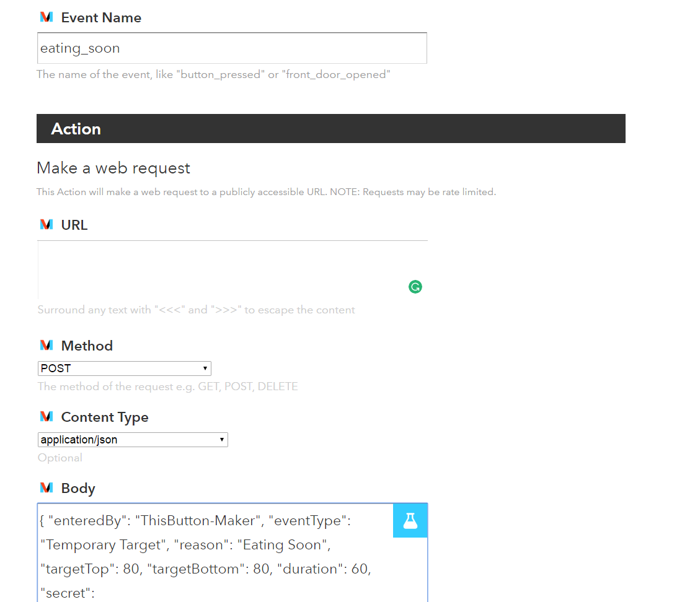
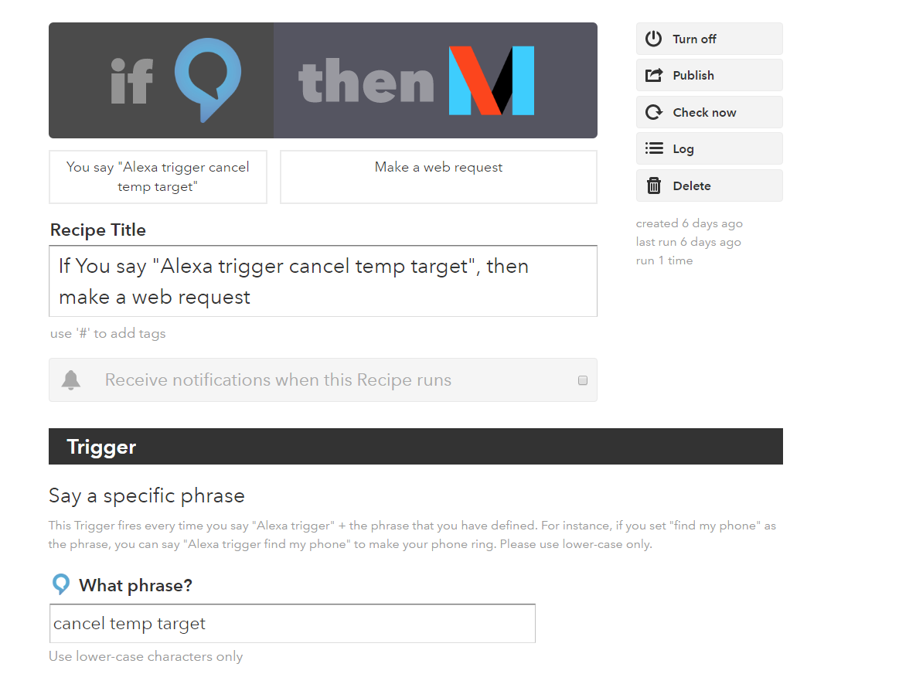
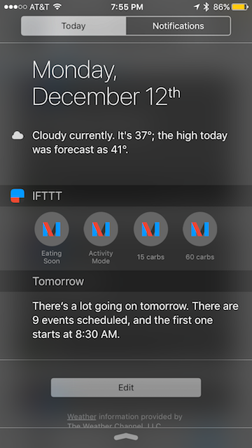

# IFTTT Integration

Want to be able to set or cancel temp targets from your Pebble, Alexa, or anything supports IFTT?  You need an IFTTT.com and Maker account.  Check it the YouTube Video below to see some sample integrations:

<a href="https://youtu.be/0ck23JTa2Wk" target="_blank"></a>


## Prerequisites

* Get an IFTTT.com account
* Make sure you have a [Maker account](https://ifttt.com/maker)
* Find out what your NS hashed secret key is by running the command to find out: `nightscout hash-api-secret <your_secret_key>`
* Or, open a console window in your browser while viewing your Nightscout site, hit refresh, and your hashed secret key will be shown as "apisecrethash: "xxxxxxxxxx...""
* Get the app ThisButton for your Pebble

## Putting it all together

* Log in to IFTTT.com.
* Select "My Applets" -> "New Applet" -> click the large "+This" -> search for Maker.
* Click "receive a web request" for step 2.
* Trigger aka Event Name: eating_soon (Maker requests must be lowercase and use underscores and not spaces)
* Now select "+That" and search for Maker again.
* Click "Make web request" for step 4.
* Action:  https://your_url_hereish.azurewebsites.net/api/v1/treatments.json <- Only change your url, don't modify what comes after it
* Method: Post
* Content Type: application/json
* Body:
```
  {"enteredBy": "ThisButton-Maker", "eventType": "Temporary Target", "reason": "Eating Soon", "targetTop": 80, "targetBottom": 80, "duration": 60, "secret": "a_totally_hashed_password_goes_here!!!"}
```


## Understanding the JSON in the Body:

* enteredBy: Will show up on the NS website this way - enter what you want
* eventType: defines what we are doing - leave as is
* reason: will show up on the NS website - enter what you want
* targets: specify the range you want - enter what you want
* duration: you can make them as long or as short as you want - enter what you want
* secret: your hashed API secret key

## Test your Maker request by going here:

* [https://ifttt.com/maker](https://ifttt.com/maker)
* Go to the settings and copy-paste the url into a new window
* Replace the {event} with one of the event like: eating_soon
* Should look like: https://maker.ifttt.com/trigger/eating_soon/with/key/{of_course_this_is_the_actual_maker_key_here_xalsdjflaksjdflakjsdf}
* Select "Test it"
  * Mine shows in about 5 seconds
  * Some folks have a bug where they need to refresh the browser.  Wait at least 30 seconds before trying this, though.

## Create more events / requests!

* activity_mode would be 140 for an hour...or whatever you want.  
* You definitely want to create a cancel_temp_target as well.  It would look like this:
```
{"enteredBy": "Alexa-Maker", "eventType": "Temporary Target", "duration": 0, "secret": "a_totally_hashed_password_goes_here!!!"}
```

## Hook it up with ThisButton for the Pebble Watch - pictured at the very top of this page

* You need to enter / get your Maker API key in the Settings for ThisButton on your phone when you go into the Pebble App
   * Your API can be found at the top of your MAKER settings (Note: There is a settings page for IFTTT and for Maker, you must be on the maker page to access Maker settings)
   * For some _absurd_ reason, the API is shown in a sans-serif font, so it's best to copy and paste the key into a document and change to a serif font (like Times New Roman) - Otherwise you can't tell the difference between an upper case i and a lower case L.
* Under Events, there are two fields
   * Name: what shows up on your watch
   * Event: the name of the Maker event to fire.  It will have underscores in it like: `eating_soon`.
* Enter all the different events you created here and Submit them.
* Fire up the ThisButton app on your Pebble and try setting a new temp target.
* You can also add the ThisButton app as a short cut on your Pebble. If you don’t have shortcuts already, press and hold either the up, down, or middle button and follow the prompts. If you have both shortcuts programmed and want to change one, go to menu > settings> quick launch and follow prompts.

## Using the DoButton

* You can hook it up and use it with the DoButton app that supports IFTTT calls...it has been tested and works using the information in 1 above.  You might need to email yourself the JSON so you can copy and paste it easily.  I permanently deleted this email afterwards since it has my secret key in it.

* Since you have IFTTT / Maker requests working, you can get it to work with anything that supports IFTTT, including Alexa.
  
  * Alexa requests do not need underscores, FYI.

## Add to the "Today" widget on your iPhone

 


* Make sure you have the IFTTT app on your phone and that you are logged in.
* Go into the "Today" (downswipe from top of phone) and scroll to the bottom - you should see 1 new widget available; otherwise click "edit". This should show a list of available widgets to add to your screen. Select IFTTT.
* It should pull in any existing applets from your IFTTT account that are set to be run by "DoButton". This means if you only added applets/recipes to work with ThisButton on Pebble, you'll need to set additional recipes up. Do similar to the above steps to add new applets; the only difference is to start with If (DoButton) Then (Maker event), aka select "DoButton" for the first tool integration, rather than Maker in both places. 
* All of the same steps apply for the Maker information for the "Then that" part - insert your URL, select POST, Content Type: application/json, etc. You'll probably want to copy and paste from your other applets, but make sure to edit the text to show that these will be entered by "DoButton" rather than "ThisButton_Maker" or similar.
* Once you've saved, these applets should show up in your Today widget for IFTTT!
